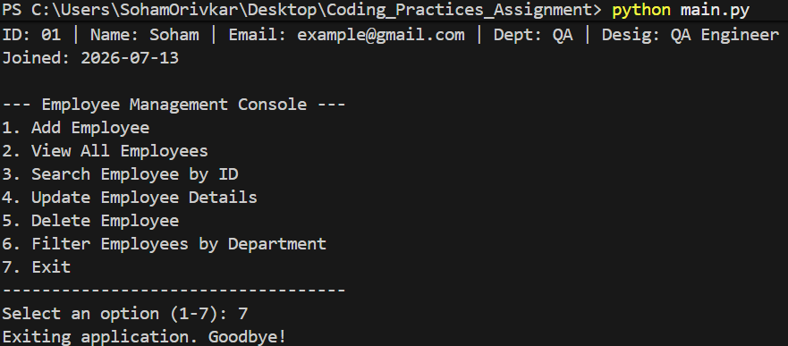

# Employee Management Console Application

A simple, robust console application written in Python to manage employee records, designed to demonstrate coding best practices.

## How to Run the Application

### Prerequisites
- Python 3.6 or higher installed.

### Steps to Run
1. Open a terminal or command prompt.
2. Navigate to the project directory: `cd Coding_Practices_Assignment`
3. Run the application:
   ```bash
   python main.py
   ```

### Running Tests
To run the automated unit tests:
```bash
python -m unittest discover tests
```

## Features Implemented
- **Add Employee:** Adds a new employee with ID, Name, Email, Department, Designation, and Joining Date.
- **View All Employees:** Displays a list of all employees (with an option to sort by name).
- **Search Employee:** Lookup an employee using their unique Employee ID.
- **Update Employee Details:** Update one or multiple fields for an existing employee.
- **Delete Employee:** Remove an employee from the system.
- **Filter by Department:** View all employees belonging to a specific department.
- **Data Persistence:** Automatically saves and loads employee data using a JSON file (`employees.json`).

## Best Practices Followed
- **Separation of Concerns:** 
  - `models/employee.py` handles data structure.
  - `services/employee_service.py` handles business logic and data persistence.
  - `utils/validators.py` handles pure validation functions.
  - `main.py` handles the user interface (console interaction).
- **Meaningful Naming:** Variables and methods have clear, descriptive names (e.g., `filter_employees_by_department` instead of `filter`).
- **Small and Focused Methods:** Each method does one thing (e.g., `is_valid_email` only validates emails).
- **Error Handling:** Used `try-except` blocks and `ValueError` to gracefully handle bad user input or missing records without crashing the application.
- **Validation:** Added email format checking and empty string checking.
- **Prevention of Duplicates:** Ensures no two employees can share the same Employee ID.

## Screenshots

### 1. Main Console


### 2. Add Employee


### 3. Show Employee


### 4. Search Employee


### 5. Update Employee


### 6. Delete Employee


### 7. Filter Employee by Department


### 8. Exit

